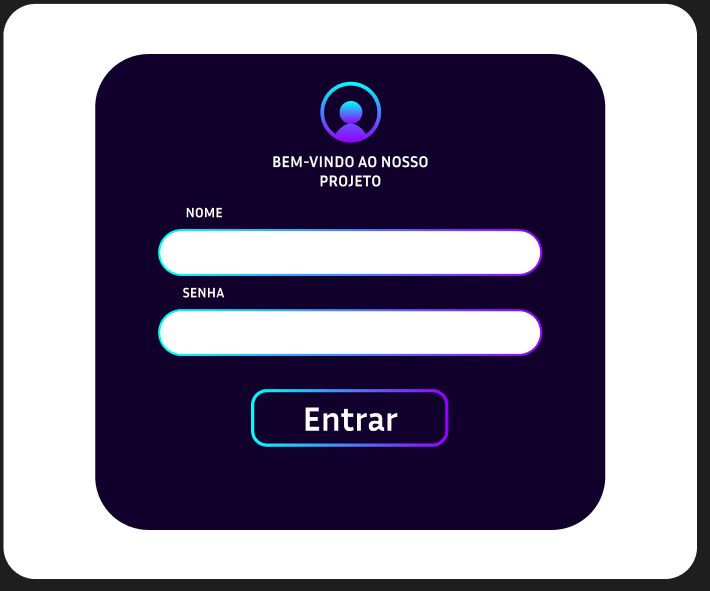
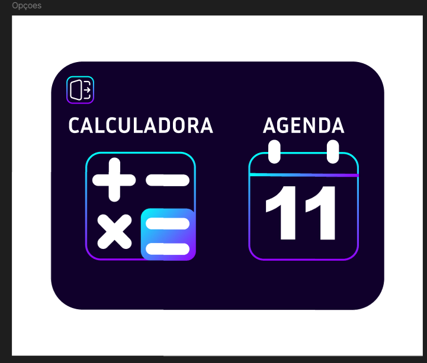
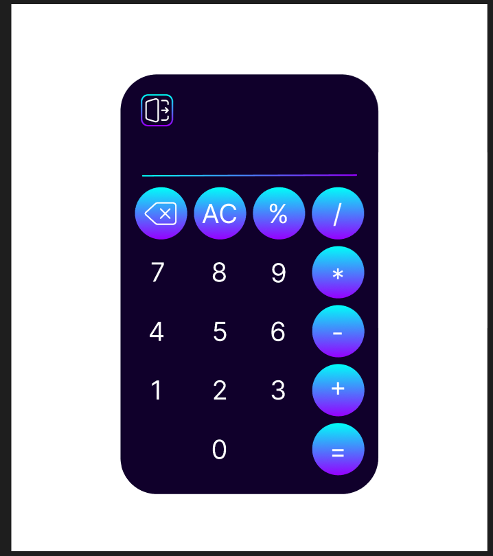
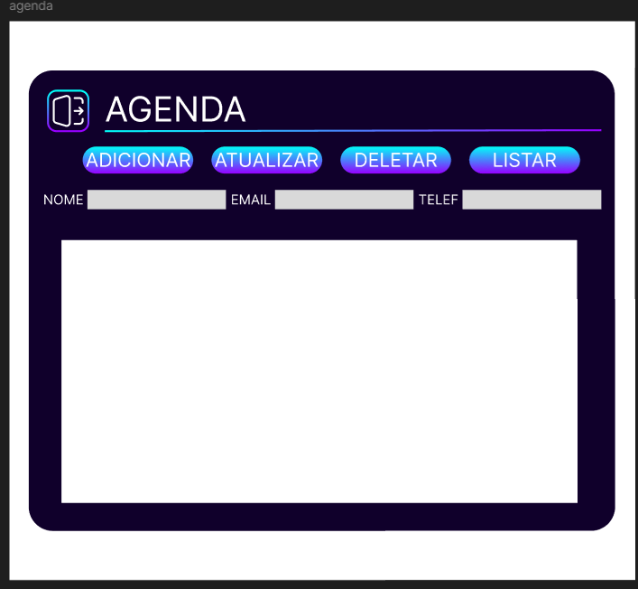

# 📱 Telas do Projeto - PlanCode

> ⚠️ **Observação:** As telas apresentadas aqui **não são as telas originais do projeto**, mas sim **um rascunho** feito pela equipe. Criamos essas telas para mostrar como gostaríamos que o design fosse, definindo cores, botões, layouts e estilo de forma conceitual.

Este repositório contém o **design visual do rascunho** do projeto desenvolvido pela equipe **PlanCode**. Todas as telas refletem as decisões da equipe quanto à aparência e identidade visual..

---

## 🖼 Telas do Projeto

### 1. Tela de Login

### 2. Tela de Seleção 

### 3. Calculadora

### 4. Agenda de Contatos

---

## 🖌 Acesso às Telas no Figma

Você pode visualizar ou editar as telas diretamente no Figma através do link abaixo:

[Figma - Telas do Projeto PlanCode](https://www.figma.com/design/LhALnUArUf0E172DbF9PLf/PlanCode?node-id=0-1&p=f&t=CeP8fsWfJ5OFKMI7-0)

