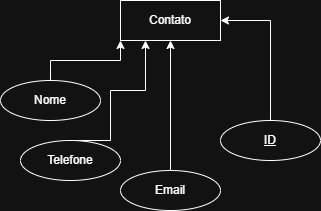
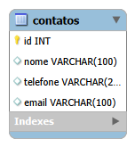

# 🗂️ Modelagem do Projeto

Este repositório contém a modelagem do banco de dados do projeto, incluindo o **DER** e o **Modelo Lógico**, ambos exportados em PNG.

---

## 📌 Diagramas

### 🔷 DER (Diagrama Entidade-Relacionamento)

O **DER** foi criado manualmente usando o aplicativo recomendado no processo (ferramenta de diagramas online).  
Representa entidades, atributos e relacionamentos do sistema.

📎 **Arquivo:** `DER.png`  


---

### 🟦 Modelo Lógico

O **Modelo Lógico** foi gerado automaticamente dentro do **MySQL Workbench**, a partir da tabela criada no banco.

📎 **Arquivo:** `logico.png`  


---

## 🗄️ Scripts SQL

Scripts utilizados para criar o banco no MySQL:

```sql
CREATE TABLE `contatos` (
  `id` int NOT NULL AUTO_INCREMENT,
  `nome` varchar(100) DEFAULT NULL,
  `telefone` varchar(20) DEFAULT NULL,
  `email` varchar(100) DEFAULT NULL,
  PRIMARY KEY (`id`)
) ENGINE=InnoDB AUTO_INCREMENT=11 DEFAULT CHARSET=utf8mb4 COLLATE=utf8mb4_0900_ai_ci;
SELECT * FROM agenda.contatos;
